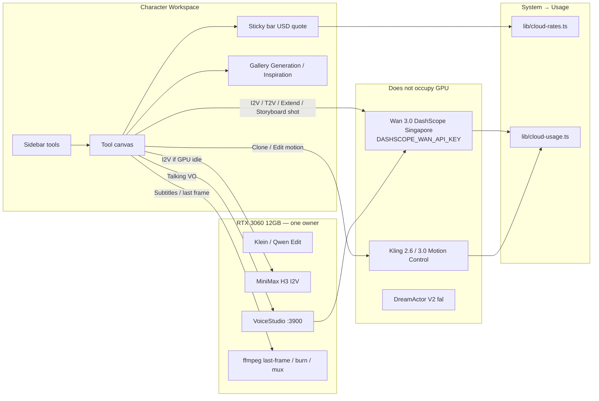
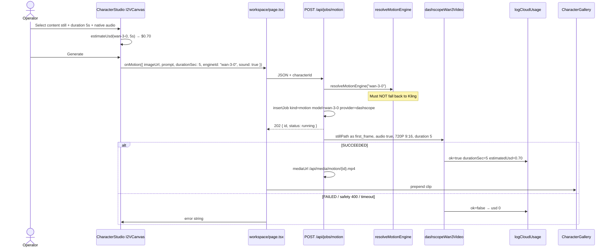
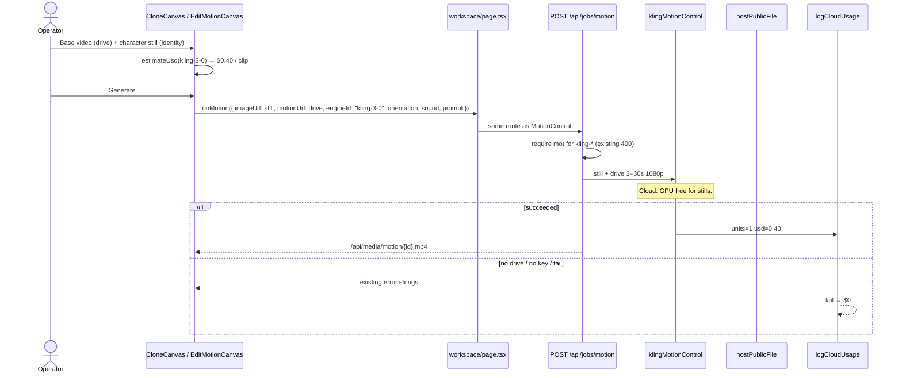

P2P LABS  ·  PRODUCT REQUIREMENTS + IMPLEMENTATION DESIGN
CreatorOS / AIOSCreator — Character Workspace Video Tools
PRD v2.0  ·  15 September 2026  ·  Status: Ready to ticket
Product: CreatorOS / AIOSCreator
Operator: P2P Labs
Author: —
Language: English
Source: APOB.ai walkthrough (Lili Hung, 2026-09-15, 1:53) + existing v1 PRD
Pixel reference: `docs/screenrec-2026-09-15/f-001.jpg` … `f-056.jpg`
Research brief: `docs/research-apob-workspace-2026-09-15.md`
Extends: `docs/AIOS_Creator_Character_Workspace_PRD_v1.md` (chrome + generate-image + thin I2V)

This is APOB information architecture, rebranded CreatorOS. Not Higgsfield Soul. Do not copy APOB logo, Follow chip, Pricing/Log in, Community marketplace, or credit integers.

---

## Overview

Character Workspace v1 shipped identity lock, generate-image, edit-image, and a thin Image-to-video canvas. The operator recorded the full APOB production chain — I2V, clone, edit-video, talking, T2V, storyboard, extend, subtitles — and asked for a mature spec before more canvas work.

v2 extends v1 for that **video-tool chain**. Stills, create-character, likeness consent, and identity lock stay as v1. The workspace keeps APOB’s IA (sidebar tools, locked `@Character` chip, preset chips, select-content from this character’s library, sticky generate bar) and routes each tool to an engine we already own: Wan 3.0 I2V/T2V in the workspace, Kling Motion Control for clone/edit-motion, VoiceStudio then I2V for talking, ffmpeg for subtitles/extend frames. The sticky bar quotes **USD from `lib/cloud-rates.ts`**, never APOB credits. Failed Wan jobs are $0 and already log that way.

---

## Background & Motivation

### Why this change

`/create/characters/:id/workspace` is the identity-locked production surface. v1 stopped at stills plus a two-pane I2V stub. The operator cannot run the daily influencer loop (still → clip → clone motion → talking → multi-shot → captions) without leaving the character.

The 112.7s APOB recording is the missing video-tool pass. Frames confirm field layout, enablement rules, and gallery chrome. v1 credit numbers (10/s I2V, 16/s clone) are superseded by the recording’s UX, but those integers are **APOB credits** (200/s I2V, 240/s clone, −1000 for 5s T2V). CreatorOS must not port them.

### Current state (code, 15 Sep 2026)

| Surface | Ready | Gap |
|---|---|---|
| Sidebar `VIDEO_TOOLS` / `IMAGE_TOOLS` | All 10 listed | 7 video tools `ready: false` → `SoonCanvas` |
| Generate / Edit image | Klein + Qwen Image Edit | Out of v2 scope |
| I2V canvas `I2VCanvas` | Thin: identity / upload + motion textarea | No select-content modal, no native-audio, no USD, duration 2/4/5/8/10, label “480P · Fast” |
| `onMotion` | `{ imageUrl, prompt, durationSec, motionUrl? }` | **No `engineId`**. Workspace POST `/api/jobs/motion` omits it. `resolveMotionEngine(undefined)` falls back to `motionEngine()`, which prefers **Kling 3.0**. Workspace I2V can hit the wrong engine. |
| Sticky I2V bar | “Free local / Paid if Seedance” | Wrong. Wan Prime 720P is $0.14/s. |
| `GpuStatus` | Any `running`/`queued` job → `gpu.busy` | Cloud Wan/Kling look like 3060 occupancy. Same bug in `waitForGpuIdle` and `reapStaleRunningJobs`. |
| AI Studio video node | Defaults `engineId: "wan-3-0"` | Correct home for Wan. |
| MotionControl `/create/motion` | Kling 2.6/3.0 + DreamActor V2 | Correct home for copy-motion. Do not move Wan here. |
| Gallery | Generation \| Inspiration; Image / Video / 4K | Exists. Inspiration is per-character moodboard, not a second identity. |
| Usage | `/system/usage` + `logCloudUsage` | Already $0 on Wan fail. |

### Pain points

1. I2V is not production-shaped (no library pick, no quote, wrong duration/resolution copy).
2. Missing `engineId` is a silent routing bug, not a cosmetic one.
3. Three GPU gates treat cloud jobs as 3060 occupancy: `GpuStatus`, `waitForGpuIdle`, and `reapStaleRunningJobs` (12 min stale vs Wan’s ~12 min poll).
4. Seven video tools are labeled Soon with no canvas — IA is complete, product is not.
5. Sticky Generate uses `cloudImage` (still engine), so Wan I2V stays disabled while Klein is selected and any local job runs.

---

## Goals & Non-Goals

### Goals

- Ship the video-tool chain on `/create/characters/:id/workspace?tool=` with APOB IA, CreatorOS brand.
- Lock the engine map (table below). One tool, one runner family.
- Quote live USD from `RATE_CARDS` / `estimateUsd()` / `money()` on the sticky bar; persist spend via existing `logCloudUsage`.
- Pass `engineId` from workspace `onMotion` so I2V cannot fall into Kling.
- Select content from **this character’s** Generation (+ Inspiration) library. Upload remains.
- Keep one-GPU-owner: one helper `jobOccupiesGpu` shared by GpuStatus, `waitForGpuIdle`, and the stale reaper. Cloud never occupies the 3060; VoiceStudio/H3/Klein wait.
- Phased PRs. PR 1 splits canvases out of `CharacterStudio.tsx` so later tool PRs do not all collide on one 1762-line file.

### Non-goals (v2)

- Rewrite generate-image, edit-image, create-character, consent, identity train (v1).
- APOB Community tab, marketplace, Follow, comments, social graph.
- APOB credit ledger (200/s, 240/s, −1000).
- LoRA / Soul ID training. Identity stays stills + `look-lock.ts` + `IDENTITY_PLATE_PROMPT`.
- Mixing product SKUs into character stills. Product catalog remains separate (`ProductPicker`, max 3 refs, `isProductMediaUrl`).
- True lipsync (LivePortrait / dedicated mouth-sync). Talking P1 is VO + I2V mouth-ish.
- Native video restyle / video inpaint / video product-swap vendor we do not have.
- 10-minute single Wan job. Storyboard is N queued shots.
- New payment gateway, dark mode, mobile native, NLE timeline.
- Porting Wan into MotionControl, or Kling into AI Studio I2V.

---

## Relationship to v1

v1 remains source of truth for:

- Create Character fields, likeness consent, `embedStatus`, delete-by-name.
- Workspace chrome (4 zones), rose accent `#E11D48`, sidebar grouping, locked `@Character`.
- Generate image Chat, Edit image Chat / face-swap / product, gallery empty copy.
- Identity inject as the product heart.

v2 **overrides** v1 only where the recording and engine reality disagree:

| Topic | v1 | v2 |
|---|---|---|
| I2V quote UX | 10 credits/s · 4s · 480P | USD from rates · default 5s · 720P Wan |
| Clone / edit-video quote | 16 credits/s | Kling per-clip estimate ($0.40 / $0.30), not /s credits |
| Talking quote | 20 credits/s | VO $0 local + I2V Wan $0.14/s |
| Extend quote | 36 credits/s | Wan $0.14/s × extend duration (output seconds only; workspace never sends `reference_video`) |
| Subtitles quote | 2 credits/s | $0 local ffmpeg/ASR |
| I2V last frame | Specced | **Soon until probed** (operator Q5). No Wan `last_frame` this cycle. Extend/storyboard = ffmpeg JPEG as `first_frame`. |
| + Add shot on I2V | P2 | P3 storyboard owns multi-shot. I2V P0 is single shot. |

---

## Engine map (locked)

| Tool | Ship with | Not this |
|---|---|---|
| Generate / Edit image | Klein + Qwen Image Edit (already) | — |
| Image to video | Wan 3.0 I2V (default) or MiniMax H3 if GPU idle | Kling (needs drive) |
| Text to video | Wan 3.0, still optional | Kling |
| Clone / Edit character+motion | Kling Motion Control (base video = drive, character still = identity). DreamActor V2 as fallback. | Wan |
| Talking video | VoiceStudio speech + Wan/H3 I2V (mouth-ish). True lipsync later. | Paid cloud TTS required |
| Storyboard | N sequential Wan/H3 shots, queue | 10-minute single job |
| Extend | Wan using last frame of previous clip as `first_frame` | Fake infinite-context |
| Add subtitles | Local ffmpeg burn via `POST /api/jobs/subtitles`. ASR only if `WHISPER_BIN` / `whisper` exists. | Paid cloud ASR required |
| Edit style / bg / product **on video** | **Soon / wontfix in v2** | Fake a video restyle API we don't have |
| Community tab | Out of scope | APOB Community masonry |

Wan 3.0 lives in **AI Studio / character workspace I2V+T2V**, not MotionControl. MotionControl = Kling 2.6/3.0 + DreamActor V2 copy-motion (still + drive). This is already encoded in `engines.ts` (`wan-3-0` group `"AI Studio"`) and `StudioCanvas.tsx` (video nodes default `engineId: "wan-3-0"`; copy-motion engines stripped off Studio nodes).

---

## Proposed Design

### Architecture



### GPU vs cloud occupancy

`GpuStatus` is only one of three gates. All three must use the **same** helper.

Today:

1. `GpuProvider` (`components/GpuStatus.tsx` 52–66) sets `busy: true` on the first `running|queued` job. No `provider` / `model` check.
2. `waitForGpuIdle` (`lib/gpu-gate.ts` 16–18) filters `listJobs()` by `running|queued` with no exception. Only caller: `POST /api/jobs/voice`. A Wan job in flight makes Talking VO wait for DashScope while VRAM is free.
3. `reapStaleRunningJobs` (`app/api/jobs/route.ts` 9–18) marks **any** `running` job failed after 12 minutes if Comfy’s queue is idle, error `"stale - GPU idle, job process died"`. `GpuStatus` polls `GET /api/jobs` every 2.5s, so the reaper runs during Wan polls. Wan’s client timeout is `90 × 8s ≈ 12 min` (`dashscope-wan.ts` 109–129) — a slow Prime job can be killed as “GPU idle” while DashScope is still running.

**Helper** (put in a **isomorphic** `lib/job-gpu.ts` with no Node/Comfy imports so the client `GpuStatus` can share it. `gpu-gate.ts` and `app/api/jobs/route.ts` import the same function):

```ts
const CLOUD_PROVIDERS = new Set([
  "dashscope", "kling", "fal", "comet", "openai", "byteplus", "hensun",
]);

export function jobOccupiesGpu(job: {
  provider?: string;
  model?: string;
  status?: string;
}): boolean {
  if (job.status && job.status !== "running" && job.status !== "queued") return false;
  const p = (job.provider || "").toLowerCase();
  if (CLOUD_PROVIDERS.has(p) || p === "ffmpeg") return false;
  const m = (job.model || "").toLowerCase();
  // Cloud engines even if provider was stored wrong. ffmpeg-mux / ffmpeg-subtitles are CPU.
  if (/^(wan-3-0|kling-|dreamactor|seedance|gpt-image|seedream|nano-banana|ffmpeg-)/.test(m)) return false;
  return true; // comfy, voicestudio, klein, qwen-edit, h3, local 4k
}
```

Rules:

- **Occupies GPU:** `provider` `comfy` | `voicestudio`, local stills (Klein / Qwen Image Edit), MiniMax H3, local 4K upscale, Comfy queue (`comfyQueueBusy()` stays a separate OR in `waitForGpuIdle`).
- **Does not occupy GPU:** Wan (`dashscope` / `wan-3-0`), Kling, DreamActor/fal, Seedance, **cloud stills** (`gpt-image-2`, `seedream-*`, `nano-banana`), **and CPU ffmpeg jobs** (`provider: "ffmpeg"` or `model` `ffmpeg-mux` / `ffmpeg-subtitles`). Cloud stills must not set `gpu.busy` either — otherwise Klein-selected Generate is fine during Seedream, but the inverse (Seedream running blocks H3) is the only correct local wait.
- `waitForGpuIdle` waits only on `jobOccupiesGpu(j)` others + Comfy queue. Voice then waits for Klein/H3, not for Wan.
- `reapStaleRunningJobs` **never** reaps a job where `!jobOccupiesGpu(j)`. Cloud jobs die via their own vendor timeout (`dashscopeWan3Video` 90×8s, Kling poll), not the GPU reaper. Do not add a second cloud reaper in v2.
- Motion route: call `waitForGpuIdle` **only** when `jobOccupiesGpu` would be true for that engine (H3 / local). Never wait for Wan/Kling.

**Sticky Generate (`CharacterStudio` 348–356, 629–632)** today:

```ts
const cloudImage = Boolean(activeImage?.cloud);
const gpuBusy = Boolean(busy) || (!cloudImage && gpu.busy);
```

`cloudImage` is the **still** engine, not the motion engine. After GpuStatus is fixed, Wan I2V is still disabled whenever Klein is selected and *any* local job is running, and the button reads `GPU busy · {elapsed}` instead of `Generate · $0.70`.

Split:

```ts
const motionCloud = ["wan-3-0", "kling-3-0", "kling-2-6", "dreamactor-v2"].includes(engineId);
const needsGpu =
  ((tool === "generate-image" || tool === "edit-image") && !cloudImage) ||
  (videoTool && engineId === "minimax-h3");
const gpuBusy = Boolean(busy) || (needsGpu && gpu.busy);
```

Wan/Kling Generate **ignores** `gpu.busy`. H3 and local Klein still honor it. Button label: `gpuBusy` → `GPU busy · {elapsed}`; else `Generate · {money}` for cloud, `Generate` for local.

Engine rows (including `cloud` and `status`) come from `GET /api/settings/engines` — already fetched in this file for stills. Do not import `lib/engines.ts` / `lib/api-providers.ts` in client components.

### Identity lock (unchanged mechanism)

No LoRA. Every video job that needs a face uses a character still:

- Default still: `character.identityUrl` (face plate from `IDENTITY_PLATE_PROMPT`).
- Operator may pick any Generation still of this character (front/body lock preferred for full-body I2V).
- Prompt stack still goes through `compileCharacterPrompt` + `lookLockBlock` for T2V/talking text. I2V motion prompt is camera/motion, not a second identity.
- Product SKUs never enter this library (`isProductMediaUrl` filter stays).

### Shared workspace chrome (v2 deltas only)

Keep v1 four-zone grid. Changes:

1. **Sticky bar** for video tools: `money(estimateUsd({ model, durationSec }))` + engine short name + duration + 720P. Generate label `Generate · $0.70` (not −1000 credits).
2. **Select content modal** (new): tabs Generation | Inspiration. No Community. Kind filter image/video by tool. Click sets the tool’s source field.
3. **`VIDEO_TOOLS.ready`**: flip per phase. Unready stay `SoonCanvas`. Never fake a canvas for an unwired runner.
4. **Accent**: workspace keeps v1 rose `#E11D48`. MotionControl / AI Studio keep CreatorOS purple `#652DFF`. Do not restyle the app as APOB.
5. **Gallery** remains under the canvas for every ready video tool (today only generate/edit/I2V mount `CharacterGallery`). Mount it for T2V/talking/clone/etc. as each tool ships. Add a **Storyboard** filter in P3.
6. **File split (PR 1):** move `VIDEO_TOOLS` / `IMAGE_TOOLS` to `components/create/workspace/tools.ts`; move `I2VCanvas`, `SoonCanvas`, and the sticky bar to `components/create/workspace/{I2VCanvas,SoonCanvas,WorkspaceStickyBar}.tsx`. Later tools add a sibling file. Do not keep stacking canvases into the 1762-line `CharacterStudio.tsx`. Generate/Edit image canvases may stay in `CharacterStudio` (v1, out of v2 scope).

### Select content modal

Replace APOB’s Generation | Community (`f-016`, `f-018`, `f-052`).

```
CharacterSelectContent
  tabs: Generation | Inspiration
  kind: "image" | "video" | "any"
  characterId
  onPick(url, kind)
```

Rules:

- Generation starts from the same sources as `CharacterGallery` `buildItems` (identity, slots, edits, completed motion jobs). `buildItems` itself does **not** call `isProductMediaUrl` (`CharacterGallery.tsx` 491–595). The skip today lives on the workspace stills list (`CharacterStudio.tsx` 337) and MotionControl. **`CharacterSelectContent` must filter with `isProductMediaUrl`.** Optionally fold the same filter into `buildItems` later.
- On-model product **edits** (`character.edits` with `mode === "product"`) are stills of this person wearing a SKU. Keep them. Packshots (`/api/media/products/`, `product-` uploads) stay out.
- Inspiration = `character.inspiration[]` (already on `Character` in `lib/character-types.ts`).
- I2V / talking driving image: `kind: "image"`.
- Clone / edit-motion / subtitles / extend source: `kind: "video"`.
- Empty Generation copy: v1 “It looks like this model is new for you. Let’s try it out!” plus Upload.
- Upload uses existing `POST /api/media/upload` (`kind: "character"` for stills, video uploads already used on MotionControl `DropSlot`).
- Do not list other characters’ assets. `@` chip already switches workspace via `router.push` on generate-image; video tools keep that pattern if we add `@` pick.

### Camera chips

Recording I2V camera menu (`f-013`): Station, Handheld, Zoom Out, Zoom In, Around Char.

Reuse prompt fragments, do not invent a camera API. Insert into the motion/description composer like other presets.

Add category `camera-movement` to `lib/prompt-presets.ts` (today: Art style, Clothing, Architecture, Landscape, Weather, Adult 18+). One camera move per shot (APOB T2V banner). Map:

| Chip | Prompt fragment (insert) |
|---|---|
| Station | locked-off tripod, no camera move |
| Handheld | handheld camera, slight shake |
| Zoom Out | slow zoom out |
| Zoom In | slow zoom in |
| Around Char. | orbit around subject |
| Follow Char. | camera follows the subject |
| Pan left / right, Tilt, Dolly | already in MotionControl `CAMERAS` (`app/create/motion/page.tsx`) — reuse the same prompt strings |

T2V: Art style global on shot 1 only; camera per shot.

---

## Tool-by-tool UX spec

Shared enablement: Generate is visibly disabled (opacity + rose off) until Valid. Disabled reason is a 12px muted string on the bar, not a silent no-op. Cloud key missing → CTA “Add Wan key in Settings” / “Add Kling key in Settings” (same pattern as image `needImageKey` → `/system/settings`).

`@Character` chip is locked, not removable, always in payload as `characterId`.

### 1. Image to video — v2 P0

**IA (from `f-011`…`f-014`, `f-020`)**

| Region | Fields | v2 P0 |
|---|---|---|
| Left | Reference image: Select content \| Upload image | Required. Default `identityUrl`. Modal = this character images. |
| Left | Add last frame + “Generate last frame from first frame” | **Soon** this cycle (operator Q5). Do not add unverified Wan `last_frame`. Extend/storyboard use ffmpeg last JPEG as `first_frame`. |
| Left | Native audio toggle “Synchronized audio-video generation” | Maps to Wan `parameters.audio` via `sound` (already `opts.sound !== false` in `dashscope-wan.ts`). Default ON. |
| Mid | Elements 0/25 | Out of P0. Preset chips optional later. |
| Right | Description (camera / smile / jacket / rain window) | Motion textarea. Optional but recommended. |
| Right | + Voice model, + Camera, + Template, + Add shot | Camera chip P0. Voice/Template/Add shot = P1/P3. |
| Bar | Duration 5 / 8 / 10 / 15 · Resolution 720P · Aspect 9:16 | Duration select those four. Resolution **read-only 720P**. Aspect **read-only 9:16** (character stills are 9:16). T2V aspect dropdown is PR 4, not P0. Do not show Fast/Ultra/UltraS or FHD/4K. |
| Bar | USD quote | Canonical helper string: `Wan 3.0 Prime 720P · ~$0.70 / 5s` |

**Engine picker (bar, small select)**

- Load motion rows from **`GET /api/settings/engines`** (same fetch already used for stills / `engineNames`). Filter to `id === "wan-3-0" | "minimax-h3"`. Never list `kling-*` / `dreamactor-v2`.
- Default `wan-3-0`. Wan is selectable when that row’s `status === "ready"` (server already ran `hasWanProvider()` / `getWanAccount()` when building `listEngines()`). Missing key → CTA “Add Wan key in Settings” → `/system/settings`, same as stills `needImageKey`. **Do not import** `listEngines`, `hasWanProvider`, or `getWanAccount` in the client canvas.
- Offer `minimax-h3` only if the engines payload says `status === "ready"` **and** `gpu.busy` is false. Label “MiniMax H3 · Free · 3060”.
- Camera chips are **in this P0 canvas** (not a follow-up). Insert MotionControl `CAMERAS` prompt strings from `app/create/motion/page.tsx` 52–62 (`"handheld camera, slight shake"`, `"slow zoom in"`, `"slow zoom out"`, `"orbit around subject"`). Add Station = `"locked-off tripod, no camera move"` and Follow Char. = `"camera follows the subject"` in `lib/prompt-presets.ts` category `camera-movement`.

**Validation**

| Condition | Generate |
|---|---|
| No reference image | Disabled · “Select or upload a still of @Name” |
| Wan selected, engines row not `ready` | CTA “Add Wan key in Settings” |
| H3 selected, GPU busy | Disabled · “GPU busy — wait or use Wan 3.0” |
| Wan selected, GPU busy | **Enabled.** Ignore `gpu.busy`. Label `Generate · $0.70` |
| Duration not in 5/8/10/15 | Coerce to 5. Default state `durationSec` **5** (today it is 4). |
| Cloud safety 400 | Fail job, Usage $0, show DashScope message |

**Generate payload**

```ts
onMotion({
  imageUrl: refImage,
  prompt: motionText,          // camera chip + description
  durationSec,                 // 5 | 8 | 10 | 15
  engineId: "wan-3-0" | "minimax-h3",
  sound: nativeAudio,          // → dashscope audio
  characterId,                 // already added in generateMotion
});
```

Do **not** pass `motionUrl` on I2V. In `app/api/jobs/motion/route.ts`, Wan with `mot` hosts a public file and sends `reference_video` + `reference_image` — that is copy-reference, not still→video.

**Acceptance**

Given character Ready with `identityUrl`, when operator picks a Generation still, duration 5s, native audio on, Wan 3.0, then Generate: POST `/api/jobs/motion` with `engineId: "wan-3-0"`, `sound: true`, `durationSec: 5`; sticky bar showed exactly `Wan 3.0 Prime 720P · ~$0.70 / 5s`; button `Generate · $0.70`; gallery Video tab gets the mp4; System → Usage logs `wan-3-0` ok with `estimatedUsd ≈ 0.14 * 5`. Fail path: Usage $0, canvas error string, no gallery card. Single 15s I2V ($2.10) does **not** show a confirm modal.

### 2. Text to video — v2 P1

**IA (`f-030`…`f-049`, `f-048`)**

Banner (keep copy, rebrand): “Each shot allows one camera movement selection, while art style is set globally in the first shot only.”

| Field | Rule |
|---|---|
| Native audio | Same Wan `audio` toggle. Default ON. |
| Voice model | **Hidden in P1.** T2V ships Wan native `audio` only. Voice-on-T2V is a follow-up that **depends on PR 5** (`muxOnly`). Do not re-implement talking’s three-call pipeline inside PR 4. |
| Presets | Existing `PRESET_CATEGORIES` + new `camera-movement`. Click = chip in composer. |
| Description | Locked `@Name` + chips + free text. Valid if text **or** ≥1 preset. |
| + Add shot | P3 (storyboard). P1 = single shot. |
| Aspect | **Live dropdown:** 9:16 (default), 3:4, 16:9, 4:3, 1:1. PR 4 wires `parameters.ratio` in `dashscope-wan.ts` from this value. I2V stays 9:16 read-only. |
| Duration | 5 / 8 / 10 / 15. Default 5. |
| Resolution | 720P read-only. |

**Still optional (lock-still ON is the default).** For identity lock, P1 **prefers** sending `identityUrl` as `first_frame` even on T2V so the face does not drift. Toggle “Lock still” default ON when `identityUrl` exists. Off = pure T2V (higher drift risk; banner warning).

Lock-still ON works with today’s motion route (still on disk). **Lock-still OFF does not**, unless PR 4 also skips the disk check — see API section. `dashscopeWan3Video` omits `media` when `stillPath` is missing, but `POST /api/jobs/motion` currently 400s on empty `imageUrl` **and** on `!fs.existsSync(src)` before the Wan branch. Both gates must be skipped for `engineId === "wan-3-0" && !imageUrl`. Pass `stillPath` only when the file exists.

Vendor behavior for T2V with an empty `media` array is **not verified** in this repo. If DashScope 400s, surface the error, keep lock-still ON as the supported path, and do not retry-loop.

**Engine:** Wan 3.0 only in P1. H3 T2V is not wired as a first-class workspace engine (H3 in this repo is I2V via `comfyH3I2V`). Audio = Wan `parameters.audio` (native toggle). No VoiceStudio on this canvas until a follow-up after PR 5.

**Validation:** Wan row `ready` from `GET /api/settings/engines`; (prompt or preset); if Lock still on, `identityUrl` required.

**Quote:** `quoteMotionBar("wan-3-0", 5)` → `Wan 3.0 Prime 720P · ~$0.70 / 5s`. Button `Generate · $0.70`.

**Acceptance (pure T2V):** lock-still off + Wan key + prompt + aspect 9:16 → POST `/api/jobs/motion` with `engineId: "wan-3-0"`, **no** `imageUrl`, `ratio: "9:16"`, job `model: "wan-3-0"`, Usage logs output seconds only. Same path with aspect 16:9 sends `ratio: "16:9"` into `dashscopeWan3Video` `parameters.ratio`.

### 3. Talking video — v2 P1

Recording hovered the sidebar; canvas was not fully shown. Spec from v1 fields + engines we have.

| Field | Rule |
|---|---|
| Driving image | Required. Select content / Upload / identity. |
| Create audio \| Select audio | Create: script 0/2000 → `POST /api/jobs/voice` (TTS). Select: list prior `kind: "voice"` jobs from `GET /api/jobs?characterId=` — **not** `CharacterGallery` (`buildItems` only appends `kind === "motion"` / `.mp4`, lines 572–590). |
| Voice | VoiceStudio voice id via `GET /api/voices` / `GET /api/settings/voice` (`listVoiceStudioVoices`). Header “+ Create Voice Model” stays a stub. |
| Mood / speed | Prompt helpers only (prepend to script). Speed 0.5x–2x is **not** in `voiceStudioSpeech` — omit. Do not fake. |
| Bar | Duration = `clamp(round(wav.durationSec), 5, 15)` after VO, or 5s if Select audio has no probe. 720P. USD = Wan seconds (VO is $0). |

**Chosen server path (one architecture — not both):**

`muxVoiceOntoClip` is server-only (`lib/voice-mux.ts`) and today runs inside `POST /api/jobs/voice` only when `clipUrl` is set **on that same TTS request**. The UI cannot import it. Passing `clipUrl` on the TTS call requires the mp4 first (I2V then VO), which fights “duration follows wav.” Doing TTS twice (once for duration, once to mux) re-spends GPU and can drift.

v2 talking is **three HTTP calls**, orchestrated in `workspace/page.tsx` / `TalkingCanvas` — no composite `/api/jobs/talking` (would duplicate the Wan runner). Additive fields on the **existing** voice route.

Today `POST /api/jobs/voice` does `if (!text) return 400 "voiceover text is empty"` (`voice/route.ts` 21–22) **before** mux. `{ muxOnly: true, wavUrl, clipUrl }` has no `text` and would 400. Gate:

```ts
const muxOnly = Boolean(body.muxOnly);
const text = (body.text || "").trim();
if (muxOnly) {
  if (!(body.wavUrl || "").trim() || !(body.clipUrl || "").trim()) {
    return NextResponse.json({ error: "muxOnly needs wavUrl and clipUrl" }, { status: 400 });
  }
} else if (!text) {
  return NextResponse.json({ error: "voiceover text is empty" }, { status: 400 });
}
```

**Steps**

1. **Probe.** `GET /api/settings/voice` (already calls `probeVoiceStudio()`). If `!probe.ok`, Generate disabled: “Start VoiceStudio on :3900”. Do not spend Wan.
2. **TTS.** `POST /api/jobs/voice` `{ text, voice, characterId }` — no `clipUrl`. `waitForGpuIdle` via `jobOccupiesGpu`. Write wav. **`probeDuration(wav)`** — exported helper using **format duration only** (wav has no `v:0`). Do **not** call private `probeVideo` as-is (`cloud-video.ts` 175–202 selects `v:0` first; duration would be 0). Persist `durationSec` on the job **inside `after()`**, after ffprobe. The 202 body is the queued job **without** `durationSec`. Client reads `durationSec` from the **completed** `pollJob` result.
3. **Scratch I2V.** `POST /api/jobs/motion` `{ engineId: "wan-3-0", imageUrl, durationSec: clamp(completedWav.durationSec, 5, 15), sound: true, prompt: "speaking to camera, natural mouth motion, blink", characterId, scratch: true }`. Route prefixes `input` with `talking-scratch |` when `scratch: true`. Keep `characterId` (needed for session resume). Do **not** omit `characterId` as a gallery trick — `jobBelongsToCharacter` also matches `identityUrl` inside `input`/`mediaUrl` (`lib/store.ts` 70–75).
4. **Mux only.** `POST /api/jobs/voice` `{ muxOnly: true, wavUrl, clipUrl, characterId }`. Skip TTS. Skip `waitForGpuIdle`. `insertJob({ kind: "motion", model: "ffmpeg-mux", provider: "ffmpeg", characterId, input: "talking-mux | …" })`. `jobOccupiesGpu` is false for `provider === "ffmpeg"` and `model` `/^ffmpeg-/`. `muxVoiceOntoClip`. 400 if either file is missing.

**`followJob` must grow an opt-out.** Today (`workspace/page.tsx` 72–87) every completed `mediaUrl` is prepended **and** `load()` runs, which re-imports every `completed && mediaUrl` job for the character. TTS wav and scratch Wan both have `mediaUrl`.

```ts
async function followJob(jobId: string, label: string, opts?: { gallery?: boolean }) {
  const job = await pollJob(jobId, …);
  if (job.status === "failed") throw …;
  if (opts?.gallery !== false) {
    load();
    if (job.mediaUrl) setClips((prev) => [job, …]);
  }
  return job; // talking reads durationSec / mediaUrl from this
}
```

Existing callers (`genSlot`, `generateMotion`) keep default `gallery: true`. Talking: TTS + scratch I2V use `{ gallery: false }`; mux uses `{ gallery: true }`.

**Durable gallery filter** (survives refresh; `load()` 40–55 and `buildItems` 572–590):

```ts
function isTalkingScratch(job: { input?: string; model?: string }) {
  return /^\s*talking-scratch\s*\|/i.test(job.input || "");
}
```

`load()` / `buildItems`: drop `isTalkingScratch`. Wav jobs (`kind: "voice"`, not `.mp4`) already skip `buildItems`; still drop them from `clips` if present.

After **successful** mux: `DELETE /api/jobs/{scratchId}` (already used on MotionControl). Filter remains the source of truth if delete is skipped.

After **mux fail**: surface the error **and** gallery the unmuxed Wan mp4 (`setClips` + skip the scratch filter for that id, or strip the `talking-scratch |` prefix). Operator must still see the $0.70 clip.

Wav remains selectable inside TalkingCanvas from `GET /api/jobs?characterId=` `kind === "voice"` (not the image/video gallery).

True lipsync is later. Do not label the output “lip sync”. Label “Talking (VO + motion)”.

### 4. Clone Video — v2 P2

**IA (`f-029`)**

| Field | APOB | CreatorOS |
|---|---|---|
| Base video | Select content \| Upload | This character’s **video** Generation + upload. Drive 3–10s still-lock or 3–30s drive-lock (mp4/mov). |
| Clone options Select all 5/5: Outfit, Background, Style, Motion, Product | Checkboxes | **Motion is the only real Kling input.** Outfit/style/background come from the **identity still**, not from toggling Wan. Show the five checkboxes as UX, but helper copy: “Kling copies body motion from the drive. Face, body, and wardrobe come from the character still.” Unchecking Motion disables Generate. Other checks are notes prepended to `prompt` (e.g. “keep the red hat”) — not separate APIs. Product check does **not** pull SKU catalog into the still. |
| Additional details | Text | Optional Kling `prompt`. |
| + Add reference character image | Overrides model image | Maps to identity still. Default `identityUrl`. Select content images. |
| Switch to Clone Image | Link | Link to `?tool=generate-image` (Clone Image tab remains stub per v1). |
| Bar | 240 credits/s · 720P/FHD · Best/Ultra | Kling 3.0 **per clip** `$0.40` (or 2.6 `$0.30`). Duration auto = drive length. Resolution 1080p (Kling). Quality taxonomy not applicable. |

**Engine:** `kling-3-0` default, `kling-2-6` fallback, `dreamactor-v2` last (weaker photoreal — same warning as MotionControl). **Not Wan.**

**Reuse** `klingMotionControl` via `POST /api/jobs/motion` with `imageUrl` (still), `motionUrl` (drive), `engineId`, `orientation`, `sound` = keep drive audio.

Workspace must not reimplement Kling. Same runner as `/create/motion`.

**Orientation (copy MotionControl, do not silent-flip in the UI):**

`klingFitDrive` (`lib/cloud-video.ts` 291–302): still-lock (`orientation: "image"`) max **10s**; drive-lock (`"video"`) max **30s**. If still-lock and probe duration > 10.05s, the runner **silently** sets `orientation` to `"video"` (“weaker identity”). Workspace must not rely on that.

- Clone default `orientation: "image"`. Use client `<video>.duration` for the enablement warning only (no new probe endpoint). If duration > 10s, **warn** and disable Generate until the operator picks “Drive orientation (max 30s)” — do not POST still-lock and hope. Helper copy: “Still-lock max 10s (stronger face). Drive-lock max 30s (better motion copy).” The runner may still auto-flip if a stale client skips the check; the UI must not rely on that.
- Edit character: same as clone (still-lock, 10s cap).
- Edit motion: `orientation: "video"`, 30s cap.
- Below 3s: existing Kling error (`Drive clip is Ns. Kling needs at least 3 seconds.`).

**Validation:** still + drive required. Kling key from engines row `ready`. Drive 3–10s for still-lock, 3–30s for drive-lock.

### 5. Edit video — v2 P2 (character / motion only)

**IA (`f-022`…`f-028`)**

Tabs: Edit character | Edit motion | Edit everything | Video face swap | Edit style | Edit shot | Edit product | Edit background | Upscale.

v2 P2 implements **Edit character** and **Edit motion** as Kling copy-motion. All other tabs: `Soon` inside the canvas (tab visible, body is SoonCanvas + one-line reason). Upscale tab may deep-link existing `/api/jobs/upscale` (already used from gallery).

| Tab | Behavior |
|---|---|
| Edit character | Source video 4–15s (Kling still works 3–30; keep APOB 4–15 helper). Optional reference image; if missing, use `identityUrl` (“we’ll choose one automatically”). Copy: “To make your character follow the video’s motion, use Edit motion.” Runner: **same Kling call**. |
| Edit motion | Same inputs; `orientation: "video"` so body facing follows the drive. |
| Edit everything | Soon — would mean restyle+swap+motion in one vendor we don't have. |
| Video face swap | Soon — no video face-swap API wired. |
| Edit style / shot / product / background | Soon. Reason: “no video restyle vendor.” **wontfix in v2.** |
| Upscale | Existing local 4K video upscale. GPU. $0. |

Bar P2: Kling per-clip quote, duration auto, 1080p. Do not show 36 credits/s.

### 6. Storyboard to video — v2 P3

**IA (`f-003`…`f-009`)**

| Field | Rule |
|---|---|
| Platform | TikTok / IG Reels / YouTube Shorts / custom. Sets default ratio 9:16 only (Wan). |
| Length | 15s, 30s, 45s, 1 min. **3 / 5 / 10 minutes listed as Soon.** 10 minutes ≠ one job. |
| Ratio | Same five values as T2V (PR 4 wired `parameters.ratio`). Default 9:16. |
| Element 0/50 | Characters: current `@Name` auto. Additional CreatorOS characters = **`@Name` prompt chips only** (no second `first_frame` — Wan media is one still). Mark “multi-identity still” Soon. Background = architecture/landscape **preset chip**, not a new asset type. Product: **do not show ProductPicker**. Operator may pick an **already on-model** Generation still as the shot’s `first_frame`, or leave identity. SKU packshots never enter the payload. |
| Video brief 0/20000 | Required with locked `@Name`. |

**Compilation (deterministic only in P3):** `N = ceil(lengthSec / 5)`, `shotSec = 5`. Copy the **same brief** onto every shot (optional: naive sentence-split on `. ` if there are ≥ N sentences; no LLM). LLM shot planning is a **follow-up PR** with a named Qwen call (`DASHSCOPE_API_KEY` / existing `revampLlmClient`) and an explicit JSON schema `{ shots: { prompt, camera }[] }`. Do not sneak it into P3.

Each shot is a Wan I2V job (`identityUrl` or on-model still as `first_frame`). Continuity: later shots call `POST /api/media/last-frame` on the previous mp4 and use that JPEG as `imageUrl`. If extract fails, fall back to `identityUrl` for that shot (no continuity, still generates — do not abort the queue). Helper ships in **PR 1** (reuse H3-long ffmpeg in `lib/comfy.ts` 1189–1196: `-sseof -0.15` then reverse fallback). Storyboard does **not** wait on the Extend canvas PR.

Queue: sequential. One in-flight Wan per character. Stop on first failed shot.

Do not stitch into a 10-minute master in P3 unless ffmpeg concat is a separate “Download sequence” action. Gallery shows each shot + optional concat.

**Quote:** `N * estimateUsd({ model: "wan-3-0", durationSec: 5 })`. Sticky: `Wan 3.0 Prime 720P · ~$4.20 / 6×5s` (format: helper per-shot × N, spelled out). **Confirm modal only when N > 1.** A single 15s I2V does not confirm.

### 7. Extend video — v2 P3

Source: Select content video \| Upload. Optional last-frame override (upload still). Description 0/2000. Native audio.

**Runner (APIs we have + PR 1 helper):**

The client cannot run ffmpeg. Do not use `video.currentTime = duration` as the production extract (acceptable only as a UI preview). Production extract is the H3-long path already in `lib/comfy.ts` 1189–1196.

1. `POST /api/media/last-frame` `{ videoUrl }` → `{ mediaUrl }` JPEG (server: `extractLastFrame`, `-sseof -0.15`, reverse fallback). Optional override: operator uploads a still instead.
2. `onMotion({ imageUrl: jpegUrl, engineId: "wan-3-0", durationSec: extendSec, sound, prompt })` — Wan `first_frame` only.
3. Optional ffmpeg concat previous+new (server follow-up; not required to ship Extend).

Do **not** require Wan `last_frame` media type. Do **not** pass the previous clip as `reference_video`. Workspace v2 **never** sends `reference_video` (see quotes). P3 default is last-frame continue (output seconds only).

Duration extend: 5 / 8 / 10 / 15. Default 5. 720P. Quote `quoteMotionBar("wan-3-0", extendSec)`.

### 8. Add subtitles — v2 P3

**IA (`f-001`, `f-055`)**

Empty player: “Your reference video will appear here once you select content or upload a video.” Select content | Upload video.

There is **no Whisper usage in this repo today.** The real P3 path is SRT upload + ffmpeg burn. The client cannot import `lib/subtitles.ts` (same constraint as last-frame / mux).

**HTTP**

- `GET /api/jobs/subtitles` → `{ asr: boolean }` (server probes `process.env.WHISPER_BIN` then `whisper` on PATH). Canvas uses this to know whether Generate can run without an uploaded SRT.
- `POST /api/jobs/subtitles` `{ videoUrl, srtUrl, characterId }` → burned mp4.

```ts
insertJob({
  kind: "motion",
  model: "ffmpeg-subtitles",
  provider: "ffmpeg", // jobOccupiesGpu false
  characterId,
  input: `subtitles | ${videoUrl} | ${srtUrl}`,
});
```

Upload SRT via existing `POST /api/media/upload`. Then POST the job. `followJob` default gallery: true. $0. Do not occupy GPU.

| Path | Behavior |
|---|---|
| `GET` says `asr: true` | Optional: server transcribes to `.srt` (editable) then burn. Still accept uploaded SRT. |
| `asr: false` (the default) | Generate disabled until `srtUrl`. Copy: “No local ASR. Upload an .srt, then Generate.” |
| Paid cloud ASR | Out of scope. |

Quote: `$0` (local). Do not show 2 credits/s. Bar: `Local · $0` + Generate.

### 9. Edit style / background / product on **video** — wontfix in v2

No video restyle vendor is wired. Do not draw a working canvas that POSTs to a fictional API.

**v2 decision: wontfix.** Tabs stay visible with Soon body + reason “no video restyle vendor.” Do not ship a wizard in the same PR as a TBD.

A later ticket (not PR 10) may do: pick a frame → existing `onEdit` → re-I2V. Honest label: “Restyle a frame, then animate.” Product must still use the catalog (max 3), never character stills.

### 10. Generate / Edit image — unchanged (v1 / P0 already)

Documented in v1. v2 does not reticket.

---

## Sequence diagrams

### Image to video (Wan 3.0)



H3 branch: same `onMotion` with `engineId: "minimax-h3"`. Runner `comfyH3I2V` occupies GPU. Motion route calls `waitForGpuIdle` only when `jobOccupiesGpu` is true for that engine.

### Clone / Edit motion (Kling)



Workspace Clone is a UI shell over the MotionControl runner. No second Kling client.

### Talking (VO → I2V → muxOnly)

```mermaid
sequenceDiagram
  participant UI as TalkingCanvas
  participant Probe as GET /api/settings/voice
  participant Voice as POST /api/jobs/voice
  participant Gate as waitForGpuIdle
  participant VS as VoiceStudio :3900
  participant Motion as POST /api/jobs/motion
  participant Mux as POST /api/jobs/voice muxOnly

  UI->>Probe: probeVoiceStudio
  alt VoiceStudio down
    Probe-->>UI: disable Generate
  end
  UI->>Voice: { text, voice, characterId }
  Voice-->>UI: 202 queued (no durationSec)
  Voice->>Gate: jobOccupiesGpu others only
  Gate->>VS: /v1/audio/speech
  VS-->>Voice: wav
  Voice->>Voice: probeDuration(wav) writes job.durationSec
  UI->>UI: pollJob completed → read durationSec
  Note over UI: followJob gallery false
  UI->>Motion: scratch true, engineId wan-3-0, durationSec clamp 5-15
  Motion-->>UI: unmuxed mp4 (input talking-scratch)
  Note over UI: followJob gallery false
  UI->>Mux: { muxOnly: true, wavUrl, clipUrl, characterId }
  Mux-->>UI: kind motion model ffmpeg-mux
  UI->>UI: followJob gallery true; DELETE scratch job
  alt mux fail
    Mux-->>UI: error
    UI->>UI: gallery unmuxed Wan so spend is visible
  end
```

---

## API / Interface Changes

### `onMotion` (breaking additive)

Today (`CharacterStudio.tsx` + `workspace/page.tsx`):

```ts
onMotion: (opts: { imageUrl: string; prompt: string; durationSec: number; motionUrl?: string }) => void;
```

A second copy lives in `app/create/characters/[id]/page.tsx` lines 211–218 (same POST, no `engineId`). That page redirects to workspace when `identityUrl` exists (line 239) and **never calls** `generateMotion` — it is dead. PR 1 **deletes** that helper. Do not leave a `characterId` POST without `engineId`.

Required v2:

```ts
export type WorkspaceMotionOpts = {
  imageUrl: string;
  prompt: string;
  durationSec: number;
  motionUrl?: string;
  engineId: string;                 // REQUIRED from workspace. No silent fallback.
  sound?: boolean;                  // Wan audio / Kling keep-audio
  orientation?: "image" | "video";  // Kling only
  lastFrameUrl?: string;            // unused this cycle — no Wan last_frame
  scratch?: boolean;                // talking I2V: prefix input talking-scratch |
  ratio?: "9:16" | "3:4" | "16:9" | "4:3" | "1:1"; // T2V; I2V omit (Wan defaults 9:16)
};

onMotion: (opts: WorkspaceMotionOpts) => void;
```

`generateMotion` in `app/create/characters/[id]/workspace/page.tsx` must POST `engineId`, `sound`, `orientation` through to `/api/jobs/motion`. Today it spreads `opts` and adds `characterId` only — once the client sends `engineId`, the route already reads `body.engineId`.

**Hard rule:** workspace I2V/T2V/talking/extend/storyboard-shot always send `engineId: "wan-3-0"` (or `"minimax-h3"`). Clone/edit-motion always send `"kling-3-0"` | `"kling-2-6"` | `"dreamactor-v2"`. If `engineId` is missing, the API should **400** when `characterId` is set, instead of `resolveMotionEngine(undefined)` → Kling. That fallback is correct for generic callers, wrong for the workspace. Implement as:

```ts
// app/api/jobs/motion/route.ts
if (body.characterId && !body.engineId) {
  return NextResponse.json(
    { error: "workspace motion requires engineId (wan-3-0 | minimax-h3 | kling-3-0 | …)" },
    { status: 400 },
  );
}
```

Do not change `resolveMotionEngine` global default (MotionControl / Studio still use it).

### `POST /api/jobs/motion` body (already exists)

```ts
{
  imageUrl?: string;
  motionUrl?: string;
  prompt?: string;
  nodeId?: string;
  engineId?: string;
  durationSec?: number;
  sound?: boolean;
  orientation?: "image" | "video";
  characterId?: string;
  scratch?: boolean;
  ratio?: "9:16" | "3:4" | "16:9" | "4:3" | "1:1";
}
```

No new route for I2V/T2V/clone. T2V with lock-still off needs **two** skips, not one. Today after the empty-`imageUrl` 400, the route still does:

```ts
const src = imageUrl.startsWith("/api/media/") ? mediaUrlToPath(imageUrl) : imageUrl;
if (!fs.existsSync(src)) {
  return NextResponse.json({ error: "source image not on disk" }, { status: 400 });
}
```

(`route.ts` 55–59.) Empty string fails `existsSync`. The Wan branch always passes `stillPath: src` (125–132). `dashscopeWan3Video` omits `media` when `stillPath` is missing or not on disk — but the route never reaches it.

PR 4 change (complete):

```ts
const imageUrl = (body.imageUrl ?? "").trim();
const allowNoStill = body.engineId === "wan-3-0" && !imageUrl;
if (!imageUrl && !allowNoStill) {
  return NextResponse.json({ error: "upload or pick a character still first" }, { status: 400 });
}
// ... insertJob ...
const src = imageUrl
  ? (imageUrl.startsWith("/api/media/") ? mediaUrlToPath(imageUrl) : imageUrl)
  : undefined;
if (src && !fs.existsSync(src)) {
  updateJob(job.id, { status: "failed", error: "source image not on disk" });
  return NextResponse.json({ error: "source image not on disk" }, { status: 400 });
}
// Wan:
await dashscopeWan3Video({
  prompt,
  stillPath: src && fs.existsSync(src) ? src : undefined,
  // videoUrl: workspace never sets this
  durationSec,
  sound,
  ratio: body.ratio || "9:16", // T2V from workspace; I2V omits → 9:16
});
```

Keep the 400 for every other engine. Lock-still ON does not need this change.

### Wan client — parameterize `ratio`; do not invent `last_frame`

`lib/dashscope-wan.ts` media types in use:

- `first_frame` — still, no `videoUrl`
- `reference_image` + `reference_video` — still + hosted drive (`hostPublicFile`)

There is **no** `last_frame`. Operator Q5: **Soon until probed.** Do not add unverified `last_frame` this cycle. I2V “Add last frame” stays Soon. Extend/storyboard keep ffmpeg last JPEG as `first_frame`.

PR 4 (T2V) changes `dashscopeWan3Video` opts:

```ts
export async function dashscopeWan3Video(opts: {
  prompt: string;
  stillPath?: string;
  videoUrl?: string;
  durationSec?: number;
  sound?: boolean;
  ratio?: "9:16" | "3:4" | "16:9" | "4:3" | "1:1";
  onProgress?: (label: string) => void;
  jobId?: string;
})
```

`parameters.ratio` = `opts.ratio || "9:16"`. I2V P0 omits `ratio` (stays 9:16). T2V sticky dropdown sends it. Other parameters unchanged: `resolution: "720P"`, `duration` clamp 2–30, `audio: opts.sound !== false`, `prompt_extend: true`, `watermark: false`.

### Voice — additive `muxOnly` (no new talking route)

Keep `POST /api/jobs/voice`. Two modes:

```ts
{
  text?: string;
  voice?: string;
  clipUrl?: string;      // existing: TTS+mux on one request. Talking P1 does not use this.
  characterId?: string;
  wavUrl?: string;       // new
  muxOnly?: boolean;     // new
}
```

| Mode | Body | Behavior |
|---|---|---|
| TTS (talking step 1) | `text`, `voice?`, `characterId` | Existing empty-text 400. `waitForGpuIdle` via `jobOccupiesGpu`. Write wav. Inside `after()`, `durationSec = probeDuration(wav)` then `updateJob`. **202 has no `durationSec`.** Client reads it from completed `pollJob`. Do **not** set `clipUrl`. `followJob(..., { gallery: false })`. |
| Mux only (talking step 3) | `muxOnly: true`, `wavUrl`, `clipUrl`, `characterId` | **Skip empty-text 400.** No TTS. No GPU wait. New job: `kind: "motion"`, `model: "ffmpeg-mux"`, `provider: "ffmpeg"`, `characterId` set. `muxVoiceOntoClip`. 400 if files missing. `followJob` gallery true. |

Motion scratch flag (talking step 2):

```ts
// POST /api/jobs/motion
scratch?: boolean; // talking I2V only
// when true: input = ["talking-scratch", prompt, imageUrl].join(" | ")
```

Export `probeDuration(path: string): number` from `lib/cloud-video.ts`: ffprobe **format duration only** (`-show_entries format=duration`). Do not reuse private `probeVideo` (it selects `v:0` first). Do not invent `/api/jobs/talking`.

### Subtitles job

`GET /api/jobs/subtitles` → `{ asr: boolean }`. `POST /api/jobs/subtitles` `{ videoUrl, srtUrl, characterId }` → burned mp4, `kind: "motion"`, `model: "ffmpeg-subtitles"`, `provider: "ffmpeg"`. Same occupancy skip as mux. Client never spawns ffmpeg.

### Last-frame extract

New small endpoint, justified because the client cannot spawn ffmpeg:

`POST /api/media/last-frame` `{ videoUrl: string }` → `{ mediaUrl: string }` JPEG.

Implementation: extract `extractLastFrame(clipPath, destPath)` into `lib/media-frame.ts` from `lib/comfy.ts` 1189–1196 (`-sseof -0.15`, reverse fallback if file missing or `< 1000` bytes). Do not duplicate a third ffmpeg snippet. Browser `video.currentTime` is not the production extract.

Used by Extend and Storyboard shot 2…N. Ships in PR 1 so those canvases do not invent it.

### Quotes (client)

Add a thin helper next to rates — do not duplicate numbers in JSX:

```ts
// lib/cloud-rates.ts (existing estimateUsd + money)
export function quoteMotionBar(model: string, durationSec?: number) {
  const card = rateFor(model);
  const est = estimateUsd({ model, durationSec, ok: true });
  if (!card || !est) return "—";
  if (card.unit === "clip") return `${card.label} · ${money(est.usd)} / clip`;
  return `${card.label} · ~${money(est.usd)} / ${est.units}s`;
}
```

**Canonical strings** (acceptance tests match these exactly; do not append a second `720P`):

- Wan 5s: `Wan 3.0 Prime 720P · ~$0.70 / 5s`
- Kling 3.0: `Kling Motion Control 3.0 · $0.40 / clip`
- H3: no `RATE_CARDS` row → `Free · local 3060` (same pattern as stills `creditLabel`)
- Fail: Usage already `ok === false → usd 0`

Workspace v2 **never** sends `reference_video` (I2V/T2V/talking/extend/storyboard omit `motionUrl`; clone uses Kling, not Wan). Therefore `quoteMotionBar` quotes **output seconds only**. Do **not** add `inputSec` to `estimateUsd` in v2. If a future path sends `reference_video`, that PR extends the helper.

### Settings keys (already)

| Env / account | Use |
|---|---|
| `DASHSCOPE_API_KEY` | Qwen LLM (`label: "qwen"`, tier gratis) |
| `DASHSCOPE_WAN_API_KEY` | Wan video only (`getWanAccount()`, Singapore `dashscope-intl`) |

Never send Wan traffic with the Qwen account. `getWanAccount()` already filters `/wan/i` label/note.

---

## Data Model Changes

No new SQL. JSON stores already used.

### `Job` (`lib/store.ts`)

Existing fields suffice: `kind: "motion" | "voice" | …`, `model`, `provider`, `characterId`, `mediaUrl`, `input`, `progress`.

Optional additive on `Job` for talking TTS:

```ts
durationSec?: number; // ffprobe on wav; used to clamp Wan duration
```

Convention for workspace lineage in `input` (already `"prompt | imageUrl | motionUrl"`):

```
`${tool} | ${engineId} | ${prompt} | ${imageUrl} | ${motionUrl || ""}`
```

Keep parseable: MotionControl `parseMotionInput` splits on ` | ` and picks media URLs. Do not break that. Prefer putting `tool` in `model` suffix only if needed; **do not** change `model` away from engine id (`wan-3-0`) — Usage `rateFor(model)` depends on it.

Optional additive field (only if a PR needs it; default skip):

```ts
tool?: "image-to-video" | "text-to-video" | "clone-video" | "talking-video" | "extend-video" | "storyboard-to-video";
```

If added, it is optional on `Job` and ignored by Usage.

### `Character` (`lib/character-types.ts`)

No change required for P0–P2. Inspiration already exists:

```ts
inspiration?: CharacterInspiration[]; // url, kind: image|video, addedAt, label?
```

Voice model id is **not** on `Character` today (v1 specced `voiceModelId`; code uses VoiceStudio global config). P1 talking uses `voice-studio.json` + per-job `voice` string. Do not invent a training table.

### Gallery boards

| Board | Source | v2 |
|---|---|---|
| Generation | identity + slots + edits + completed jobs for this `characterId` | Unchanged. Video tools write motion jobs with `characterId` so they appear. |
| Inspiration | `character.inspiration` via `?op=inspiration` | Unchanged. Pin from Generation. Pose/lighting refs — not a second identity (`look-lock` comment). |
| Community | APOB only | **Do not build.** |

`CharacterGallery` tabs today: Image / Video / 4K Image / 4K Video. APOB had All / Video / Image / Storyboard. P3 add Storyboard tab (jobs whose `input` starts with `storyboard-to-video` or concatenated sequences). Until then, storyboard shots land in Video.

Product **packshots** are excluded in `CharacterSelectContent` (and the workspace stills list) via `isProductMediaUrl`. On-model product edits remain. Do not assume `buildItems` already filters.

### Migration

None. New jobs only. Old I2V clips without `engineId` in the request already stored `model` from whatever `motionEngine()` was — leave them.

---

## Credit / USD quote formula

Source of truth: `lib/cloud-rates.ts` `RATE_CARDS` + `estimateUsd` + `logCloudUsage` enrich.

```
quotedUsd = estimateUsd({ model, durationSec, units, ok: true }).usd
chargedUsd = job.ok ? quotedUsd : 0
```

| Engine | Unit | List | Workspace formula |
|---|---|---|---|
| `wan-3-0` | sec | $0.14 | `round(0.14 * max(1, round(durationSec)))` to 4 dp. Default duration 5 → **$0.70**. Card note (vendor invoice) mentions input+output seconds; **workspace v2 never sends `reference_video`**, so the quote is always output seconds. |
| `kling-3-0` | clip | $0.40 | Always 1 clip. Duration does not multiply. |
| `kling-2-6` | clip | $0.30 | Same. |
| `dreamactor-v2` | sec | $0.05 | `0.05 * driveSec`. |
| `minimax-h3*` | — | — | $0. Label Free · local 3060. |
| VoiceStudio | — | — | $0. |
| ffmpeg subtitles / last-frame | — | — | $0. |
| Failed any cloud | — | — | **$0**. Already: `estimateUsd({ ok: false })` and `spendUsd` sums only `e.ok`. |

**Do not display** 200, 240, 36, 16, 10, 2, or −1000. Those are APOB credits.

Sticky bar left cluster:

```
{quoteMotionBar(engineId, durationSec)}
```

Generate button:

```
Generate{quoted ? ` · ${money(quoted)}` : ""}
```

Header “100%” remains v1 plan meter, not a credit integer.

**Confirm modal:** only when the run is **N > 1 shots** (storyboard). A single 15s Wan is `$2.10` and must **not** modal. Do not use a $2 USD threshold. Close Q6.

---

## How workspace `onMotion` should pass `engineId`

Call sites:

| Tool | `engineId` | `imageUrl` | `motionUrl` | `sound` | `orientation` |
|---|---|---|---|---|---|
| image-to-video | `wan-3-0` or `minimax-h3` | required still | omit | native toggle | omit |
| text-to-video | `wan-3-0` | identity if lock on, else `""` | omit | native toggle | omit (`ratio` set) |
| talking-video | `wan-3-0` or H3 | driving still | omit (`scratch: true`) | true | omit |
| extend-video | `wan-3-0` | extracted last frame | omit | native toggle | omit |
| storyboard shot | `wan-3-0` or H3 | identity or prior last frame | omit | native toggle | omit (`ratio` from storyboard) |
| clone-video | `kling-3-0` (default) | character still | **required drive** | keep-audio | `image` default |
| edit-character | `kling-3-0` | still or identity | **required drive** | keep-audio | `image` |
| edit-motion | `kling-3-0` | still or identity | **required drive** | keep-audio | `video` |

`generateMotion` forwards the object as JSON. `insertJob.model = engine.id` so Usage `rateFor` hits `wan-3-0` / `kling-3-0`. T2V/storyboard also forward `ratio`. I2V omits `ratio` (Wan defaults 9:16).

Studio video node already passes `engineId: data.engineId` (defaults Wan). MotionControl page already passes `engineId: model || engineId` (defaults Kling). Workspace is the missing caller. Thin I2V `generate()` in PR 1 must pass `engineId: "wan-3-0"` **in the POST body**, not only on the TypeScript type — the type change alone does not fix routing.

Dead caller: delete `generateMotion` from `app/create/characters/[id]/page.tsx` (defined, never invoked).

---

## Gallery: Generation vs Inspiration

Already implemented in `CharacterGallery` + `Character.inspiration` + `POST /api/characters/:id?op=inspiration`.

**Generation** = everything this character produced (stills + motion jobs with `characterId`). Empty copy: “It looks like this model is new for you. Let’s try it out!”

**Inspiration** = operator-pinned moodboard. Code comment: “Pose/lighting refs — not a second identity.” Empty: “Pin a generation to this board.”

v2 uses Generation as the Select content library (APOB Community is dropped). Inspiration is a second tab in the same modal so the operator can pick a pinned beach still as an I2V first frame without hunting.

`onUseAsReference` today only handles images and routes by current tool (I2V sets `refImage`, edit sets base/extra, else pose ref). Extend it: video items set clone/edit/extend/subtitles source when those tools are active.

Do not mix product packshots into either board (`isProductMediaUrl` in the select-content modal; on-model edits stay).

---

## Alternatives Considered

### A. Port APOB credit integers and a local ledger

Pros: pixel parity with the recording. Cons: 200/s is meaningless in USD; we already have Usage + `RATE_CARDS`; failed-job refunds would be a second ledger. **Rejected.** Quote USD.

### B. One “video engine” dropdown shared with MotionControl (Wan and Kling in one picker)

Pros: fewer pickers. Cons: operators will send I2V to Kling without a drive (400) or clone to Wan (wrong identity behavior). Engines.ts already splits groups “AI Studio” vs “Motion control”. **Rejected.** Tool decides engine family; optional Wan vs H3 only on I2V.

### C. Train a character LoRA / Soul ID for identity

Pros: stronger lock on T2V. Cons: out of scope, 3060 time, v1 identity is stills + look-lock. **Rejected for v2.**

### D. Storyboard as a single long MiniMax H3-long 60s job

Pros: one file. Cons: `minimax-h3-long` is chunked 5s windows on 12GB, seams, GPU locked for N×5s, and 10-minute APOB lengths are not one runner. Wan max 30s. **Rejected** as the storyboard implementation. H3-long may be an optional engine for a single 15–60s shot, not for 10 minutes.

### E. Fake video restyle by calling an image editor on every frame

Pros: fills Edit style/bg tabs. Cons: drift, cost, time, we would present a capability we do not have. **Rejected.** v2 wontfix; later ticket may restyle-one-frame-then-I2V.

### F. Dedicated `POST /api/jobs/i2v` vs reuse `POST /api/jobs/motion`

Pros of a new route: T2V-without-still is a natural 400 on a still-first handler; workspace would not share Kling validation. Cons: second Wan client, second job `kind`, Usage `model` split, Studio + workspace diverge. **Rejected.** One motion route. T2V-without-still is an explicit `allowNoStill` branch on that route (PR 4), not a new endpoint. Winner recorded as Key Decision 20.

### G. Composite `POST /api/jobs/talking` vs three client-orchestrated calls

Pros of a composite: one gallery card, one error, duration+mux inside the server. Cons: duplicates the Wan runner and GPU-wait policy already in motion/voice; harder to resume after a Wan 400; talking would not reuse `onMotion`. **Rejected.** Talking is TTS → I2V → `muxOnly` on the existing voice route. The UI never imports `muxVoiceOntoClip`. Winner: Key Decision 16.

### H. Browser last-frame (`video.currentTime = duration`) vs ffmpeg

Pros of browser still: no new endpoint. Cons: CORS, color-space, not what H3-long uses, cannot run in `after()` on the server. **Rejected** as the production extract. ffmpeg `-sseof -0.15` + reverse fallback, exposed as `POST /api/media/last-frame`. Preview-only browser grab is allowed in the canvas.

---

## Security & Privacy Considerations

| Threat | Severity | Mitigation |
|---|---|---|
| Wan key mixed with Qwen LLM key | High | `getWanAccount()` only. Singapore intl host. Never log raw keys (`logCloudUsage` already redacts `sk-…`). |
| Drive clip hosted publicly for Kling/Wan (`hostPublicFile` → litterbox/0x0) | Medium | Existing MotionControl behavior. Workspace clone inherits it. Banner: “Drive is uploaded to a temporary public host for the vendor.” Prefer 24h litterbox. Do not host character stills unnecessarily — Wan I2V uses data-URL `first_frame` (already). |
| NSFW on cloud Wan/Kling | Medium | Local Qwen/Klein may generate adult stills. Cloud **will** 400 on safety. Surface vendor message. Do not retry-loop. Usage $0. |
| Non-consensual likeness | High | v1 consent checkbox unchanged. Workspace does not add a Community grab of other users’ faces. |
| Product SKU leakage into character library | Low | Keep `isProductMediaUrl` + ProductPicker. Clone “Product” checkbox does not import SKUs. |
| Prompt injection via `@` / community | Low | No Community. `@` only switches to another local character workspace. |
| Spend runaway (storyboard 10 min) | High | 3/5/10 min Soon. Confirm modal when N > 1. Serialize Wan. |

Auth: single-operator local app (existing). No new public sharing in v2.

---

## Observability

### Logging

- Every Wan/Kling/fal call already goes through `logCloudUsage` (`dashscope-wan.ts` `log(ok)`, Kling `withCloudFailover` `{ kind: "motion", jobId, units: 1 }`).
- Job `progress` strings: keep “Wan 3.0 submitted…”, “Wan 3.0 RUNNING”, Kling statuses.
- Workspace should pass `jobId` into Wan log if not already (Wan `logCloudUsage` currently omits `jobId` — P0 small fix: add `jobId` to `dashscopeWan3Video` opts).

### Metrics (Usage page)

Existing `/system/usage` dashboard: spendUsd, fail count, byModel `wan-3-0` / `kling-3-0`. No new backend.

Add `kind` / tool label only in job `input` prefix so operators can filter mentally. Optional later: Usage filter by `characterId`.

### Alerting (single operator)

- Sticky error on 400 safety / missing key / GPU wait > 5 min.
- Storyboard: stop queue on first failed shot; do not keep spending.
- Wan timeout (90 × 8s ≈ 12 min in client): fail job, $0.

### Latency targets (expected, not SLO)

| Path | Typical |
|---|---|
| Wan I2V 5s 720P | 1–4 min wall (async poll 8s) |
| Kling MC 5–10s | 2–6 min |
| H3 5s | GPU minutes; blocks stills |
| VO | seconds–1 min after GPU idle |
| Subtitles burn | seconds |

---

## Rollout Plan

Feature flags: none required (single operator). Phase by `VIDEO_TOOLS[].ready` and merge order.

1. **PR 1 plumbing** — `jobOccupiesGpu` in GpuStatus + gpu-gate + stale reaper; `engineId` required; thin I2V POST includes `engineId: "wan-3-0"`; last-frame helper; split canvas files.
2. **PR 2** select-content (parallel to 1).
3. **PR 3** I2V canvas parity (`ready` already true).
4. Flip `text-to-video` / `talking-video` / `clone-video` when those canvas files ship (PRs 4–6, parallel after 3).
5. Flip `extend-video` then `storyboard-to-video` (last-frame already in PR 1). Subtitles can parallel.
6. Style/bg/product video stay `ready: false` (wontfix).

Rollback: set `ready: false` on the tool; canvas returns `SoonCanvas`. Cloud keys unchanged. No DB migration to reverse.

Staged spend: operator watches `/system/usage`. First Wan 5s is $0.70. Confirm modal only for storyboard N > 1.

---

## Risks

| Risk | Severity | Mitigation |
|---|---|---|
| Workspace I2V already routing to Kling | **High** (present) | P0 plumbing: require `engineId` when `characterId` set; I2V always `"wan-3-0"`. |
| GpuStatus / gpu-gate / stale reaper treat Wan as GPU | **High** (present) | One `jobOccupiesGpu` helper; never reap cloud as GPU-stale; sticky bar ignores `gpu.busy` for Wan/Kling. |
| Wan safety 400 on adult stills | Medium | Honest error; keep local Qwen path for stills; do not claim cloud NSFW. |
| Identity drift on T2V without still | Medium | Default lock-still ON. |
| Kling “clone” does not preserve APOB outfit/bg toggles independently | Medium | Copy in UI; do not pretend checkboxes call extra models. |
| `hostPublicFile` third-party host outage | Medium | Existing MotionControl failure mode; surface error. |
| Storyboard spend | High | Cap live lengths; serialize; confirm when N > 1. |
| Last-frame UI promised, API missing | Low | Operator: Soon until probed. Control labeled Soon. Extend/storyboard use ffmpeg + `first_frame`. |
| H3 OOM on 12GB | Medium | Default Wan. H3 only if ready and GPU idle. |

---

## Open Questions

Q1. Parameterize Wan `ratio` so T2V aspect dropdown is real? **Closed (operator).** Wire Wan `parameters.ratio` now. T2V dropdown is live: 9:16, 3:4, 16:9, 4:3, 1:1. Extra work in `dashscope-wan.ts`, shipped in **PR 4** (not P0 I2V). I2V stays 9:16 (character stills are 9:16).

Q2. Talking: mux VO over Wan vs rely on Wan native `audio` only? **Closed.** Mux VO via `POST /api/jobs/voice` `{ muxOnly: true }` after I2V. Native audio stays on during I2V as bed, then ffmpeg `-map 1:a:0` replaces it. Not a composite talking route.

Q3. Additional characters in storyboard: second `first_frame`? **Closed: no.** `@Name` chips only. Multi-identity still is Soon.

Q4. Voice model training from header CTA? **Not v2 P1.** Use VoiceStudio catalog. Header button may deep-link VoiceStudio docs/settings.

Q5. Should `dashscopeWan3Video` grow `last_frame` this cycle? **Closed (operator): Soon until probed.** Do not add unverified `last_frame` this cycle. I2V “Add last frame” stays Soon. Extend/storyboard keep ffmpeg last JPEG as `first_frame`.

Q6. Confirm-modal threshold $2 — OK for this operator? **Closed.** Confirm only when N > 1 (storyboard). Single 15s Wan ($2.10) does not modal.

Q7. Edit everything / video face swap: wontfix until vendor, or hide tabs? **Closed: show tabs, Soon body** (IA complete, no fake canvas) — same as v1 sidebar rule. Video style/bg/product is **wontfix** for v2.

---

## Key Decisions

1. **v2 extends v1.** Do not rewrite stills, create, consent, look-lock, or product-catalog rules.
2. **IA from APOB, brand CreatorOS.** Keep sidebar, `@Character`, presets, select-content, sticky bar. Do not copy logo, Community, Follow, Pricing, or credit integers.
3. **Workspace accent stays rose `#E11D48` (v1).** Purple `#652DFF` stays on MotionControl / AI Studio.
4. **Engine homes are locked.** Wan 3.0 = AI Studio + workspace I2V/T2V/extend/storyboard shots. Kling/DreamActor = MotionControl + workspace clone/edit-motion. Never swap.
5. **Two Alibaba keys stay split.** `DASHSCOPE_API_KEY` = Qwen LLM. `DASHSCOPE_WAN_API_KEY` = Wan Singapore. `getWanAccount()` only for video.
6. **One GPU owner, one helper.** `jobOccupiesGpu` lives in isomorphic `lib/job-gpu.ts` (no Comfy/fs) so `GpuStatus` can share it with `waitForGpuIdle` and `reapStaleRunningJobs`. Occupy GPU for Comfy / VoiceStudio / Klein / Qwen Edit / H3 / local 4K. **Do not** occupy for Wan, Kling, fal, Seedance, cloud stills (gpt-image-2, seedream, nano-banana), **or CPU ffmpeg** (`provider: "ffmpeg"`, `model` `ffmpeg-mux` / `ffmpeg-subtitles`). Never reap cloud jobs as `"stale - GPU idle"`. Sticky Generate: Wan/Kling ignore `gpu.busy`; H3 and local Klein honor it.
7. **USD from `lib/cloud-rates.ts`.** Wan Prime 720P = **$0.14/s** (5s = $0.70). Kling 3.0 = $0.40/clip. Failed Wan = **$0**. Log to System → Usage. No APOB 200/240/−1000.
8. **Identity lock = stills + `look-lock.ts` / `IDENTITY_PLATE_PROMPT`.** No LoRA/Soul ID train in v2.
9. **Product SKUs never enter character stills.** Max 3 refs via `ProductPicker`. `isProductMediaUrl` remains the filter.
10. **NSFW allowed on local Qwen/Klein.** Cloud may 400; show the vendor error; do not retry-spam.
11. **Workspace `onMotion` must send `engineId`.** If `characterId` is set and `engineId` missing → 400. I2V default `wan-3-0`. Clone default `kling-3-0`. Thin I2V `generate()` POSTs `engineId: "wan-3-0"` in PR 1 (type-only is not a fix). Delete the unused `generateMotion` on `app/create/characters/[id]/page.tsx`.
12. **Select content = this character’s Generation \| Inspiration.** Community is out of scope.
13. **I2V last-frame is Soon until probed (operator Q5).** Do not add unverified Wan `last_frame` this cycle. `dashscope-wan.ts` keeps `first_frame` and `reference_video` only. Extend/storyboard use ffmpeg last JPEG as `first_frame`.
14. **I2V P0 duration 5/8/10/15, 720P read-only, aspect 9:16 read-only, native audio → Wan `audio`.** Character stills are 9:16. Quality Fast/Ultra/UltraS is not a Wan parameter — omit.
15. **T2V prefers sending `identityUrl` as `first_frame`.** Pure T2V is opt-out and requires the motion-route disk-check skip (`allowNoStill`), not only the empty-`imageUrl` 400 change. T2V aspect is a **live** dropdown (9:16 / 3:4 / 16:9 / 4:3 / 1:1) wired in PR 4 via `dashscopeWan3Video` `parameters.ratio`.
16. **Talking P1 = three HTTP calls:** TTS (`POST /api/jobs/voice`) → scratch Wan I2V (`scratch: true`, input prefix `talking-scratch |`) → mux (`POST /api/jobs/voice` `{ muxOnly: true }` **skips empty-text 400**; job `kind: "motion"`, `model: "ffmpeg-mux"`, `provider: "ffmpeg"`). Not a composite `/api/jobs/talking`. Not labeled lip sync. `followJob(..., { gallery: false })` for TTS + scratch I2V; gallery true only for mux. `load()` / `buildItems` drop `talking-scratch`. Mux fail galleries the unmuxed Wan clip. `durationSec` is read from the **completed** TTS poll, not the 202. Probe VoiceStudio before spending Wan.
17. **Clone/Edit motion reuse `klingMotionControl`.** No second client. Outfit/bg/style/product checkboxes are prompt notes, not extra models.
18. **Storyboard = N queued 5s shots**, `N = ceil(lengthSec / 5)`, same brief on every shot. Not a 10-minute single job. 3/5/10 min lengths are Soon. Extra characters = `@Name` chips only (no second `first_frame`). No ProductPicker; on-model still optional as `first_frame`. Continuity via PR 1 `POST /api/media/last-frame`; fallback identity if extract fails. Confirm modal when **N > 1** only.
19. **Video style/bg/product restyle is wontfix in v2.** Tabs Soon. Do not fake a video restyle API. A later ticket may restyle a frame then re-I2V.
20. **Reuse motion + voice routes.** I2V/T2V/clone stay `POST /api/jobs/motion` (Alternative F). Talking mux is additive `muxOnly` on `POST /api/jobs/voice` (Alternative G). Quotes stay `estimateUsd` / `money` / `quoteMotionBar`. Extra endpoints the client needs because it cannot spawn ffmpeg: `POST /api/media/last-frame`, `GET`+`POST /api/jobs/subtitles`. No `/api/jobs/i2v` or `/api/jobs/talking`. T2V P1 is Wan native audio only — Voice-on-T2V waits for PR 5.
21. **Workspace never sends Wan `reference_video`.** I2V/T2V/extend/storyboard omit `motionUrl`. Quote is always output seconds. Do not add `inputSec` to `estimateUsd` in v2.
22. **Sticky quote string is `quoteMotionBar` output.** Wan 5s = `Wan 3.0 Prime 720P · ~$0.70 / 5s`. Acceptance tests match that string.
23. **Client engine/key checks use `GET /api/settings/engines`.** Never import `listEngines` / `hasWanProvider` / `getWanAccount` in `"use client"` files.
24. **PR 1 splits workspace canvases** into `components/create/workspace/*` so PRs 3–9 do not all edit `CharacterStudio.tsx`. Until that split lands, treat tool PRs as serial. After it, merge order: 1 → 2 (∥ 1) → 3 → (4 ∥ 5 ∥ 6 ∥ 8 ∥ 9) → 7. PR 10 is docs/wontfix.
25. **Wan `ratio` is parameterized in PR 4, not P0.** T2V (and later storyboard) send `ratio`. I2V omits it and stays 9:16. Default in `dashscope-wan.ts` remains `"9:16"`.

---

## References

- `docs/AIOS_Creator_Character_Workspace_PRD_v1.md` — chrome, stills, thin I2V, consent
- `docs/research-apob-workspace-2026-09-15.md` — recording walk, engine proposal, credit reality check
- `docs/screenrec-2026-09-15/f-001.jpg` … `f-056.jpg`
- `apps/web/components/create/CharacterStudio.tsx` — `VIDEO_TOOLS`, `IMAGE_TOOLS`, `I2VCanvas`, `SoonCanvas`, sticky bar, `onMotion`
- `apps/web/app/create/characters/[id]/workspace/page.tsx` — `generateMotion` (missing `engineId`)
- `apps/web/lib/character-types.ts` — `Character`, `CharacterInspiration`
- `apps/web/lib/prompt-presets.ts` — Art style, Clothing, Architecture, Landscape, Weather, Adult
- `apps/web/app/api/jobs/motion/route.ts` — `wan-3-0`, `kling-*`, `dreamactor-v2`, `minimax-h3*`
- `apps/web/lib/dashscope-wan.ts` — `wan3.0-video-prime`, 720P, 2–30s, `audio`, `first_frame`, `reference_video`; PR 4 adds `parameters.ratio`
- `apps/web/lib/cloud-rates.ts` + `lib/cloud-usage.ts` + `app/system/usage/page.tsx`
- `apps/web/app/create/motion/page.tsx` — Kling-only MotionControl
- `apps/web/components/studio/nodes.tsx` + `StudioCanvas.tsx` — Studio video default Wan 3.0
- `apps/web/lib/engines.ts` — `resolveMotionEngine`, Wan group AI Studio
- `apps/web/lib/api-providers.ts` — `getWanAccount`, split keys
- `apps/web/lib/look-lock.ts` + `lib/character-prompts.ts` — identity
- `apps/web/lib/gpu-gate.ts` + `components/GpuStatus.tsx` + `app/api/jobs/route.ts` (`reapStaleRunningJobs`)
- `apps/web/lib/voice-studio.ts` (`probeVoiceStudio`) + `app/api/jobs/voice/route.ts` + `lib/voice-mux.ts`
- `apps/web/lib/comfy.ts` 1189–1196 (H3-long last-frame ffmpeg to extract)
- `apps/web/app/create/characters/[id]/page.tsx` — dead `generateMotion`
- `apps/web/components/create/CharacterGallery.tsx`
- `GROK.md` — local-first commerce OS, T0 12GB, no new foundation models

---

## PR Plan

After PR 1 splits canvases, later tool PRs add a sibling file and should not fight on `CharacterStudio.tsx`. Until PR 1 lands, do not start PRs 3–9 in parallel.

**Merge order:** 1 → 2 (parallel with 1) → 3 → (4 ∥ 5 ∥ 6 ∥ 8 ∥ 9) → 7 → 10 (docs/wontfix).

Flip `ready: true` only in the PR that ships that canvas. I2V is already `ready: true`.

### PR 1 — Workspace motion plumbing (blocking)

**Title:** fix(workspace): jobOccupiesGpu, require engineId, quoteMotionBar, last-frame helper, split canvases

**Files / components**

- `apps/web/lib/job-gpu.ts` (new, isomorphic) — `jobOccupiesGpu`; no Comfy/fs imports
- `apps/web/lib/gpu-gate.ts` — `waitForGpuIdle` filters with `jobOccupiesGpu`
- `apps/web/components/GpuStatus.tsx` — `busy` from `jobOccupiesGpu` on polled jobs (`provider` + `model` already on `GET /api/jobs`)
- `apps/web/app/api/jobs/route.ts` — `reapStaleRunningJobs` skips `!jobOccupiesGpu(j)`
- `apps/web/app/api/jobs/motion/route.ts` — 400 if `characterId && !engineId`; `waitForGpuIdle` only when the resolved engine occupies GPU
- `apps/web/app/create/characters/[id]/workspace/page.tsx` — `WorkspaceMotionOpts`; POST `engineId`, `sound`, `orientation`
- `apps/web/components/create/CharacterStudio.tsx` — thin I2V `generate()` **POSTs `engineId: "wan-3-0"`**; split `gpuBusy`; default `durationSec` 5
- `apps/web/app/create/characters/[id]/page.tsx` — **delete** unused `generateMotion`
- `apps/web/lib/cloud-rates.ts` — `quoteMotionBar()` (canonical strings)
- `apps/web/lib/dashscope-wan.ts` — pass `jobId` into `logCloudUsage`
- `apps/web/lib/media-frame.ts` (new) — `extractLastFrame` lifted from `lib/comfy.ts` 1189–1196
- `apps/web/app/api/media/last-frame/route.ts` (new) — `POST { videoUrl }` → `{ mediaUrl }`
- `apps/web/lib/cloud-video.ts` — export `probeDuration` (ffprobe format duration; wav + mp4)
- Split (move-only, no behavior change beyond the above):
  - `components/create/workspace/tools.ts` (`VIDEO_TOOLS`, `IMAGE_TOOLS`)
  - `components/create/workspace/I2VCanvas.tsx`
  - `components/create/workspace/SoonCanvas.tsx`
  - `components/create/workspace/WorkspaceStickyBar.tsx`

**Depends on:** none

**Description:** Fixes silent Kling routing, false GPU lock, and Wan-vs-12-min reaper race. Last-frame helper unblocks Extend and Storyboard later. Canvas split unblocks parallel tool PRs. Sticky I2V bar can already show `Wan 3.0 Prime 720P · ~$0.70 / 5s`.

### PR 2 — Select content modal

**Title:** feat(workspace): CharacterSelectContent from Generation + Inspiration

**Files / components**

- `apps/web/components/create/CharacterSelectContent.tsx` (new)
- `apps/web/components/create/workspace/I2VCanvas.tsx` — use modal (or CharacterStudio until PR 1 split merges)
- `apps/web/components/create/CharacterGallery.tsx` — optional `onUseAsReference` for videos; optional `isProductMediaUrl` inside `buildItems`

**Depends on:** none (parallel to PR 1)

**Description:** Tabs Generation | Inspiration. Kind filter. **Filter packshots with `isProductMediaUrl` in the modal** (do not trust `buildItems`). Keep on-model product edits. Upload remains. No Community tab.

### PR 3 — I2V canvas parity (v2 P0)

**Title:** feat(workspace): I2V canvas parity (select still, 5/8/10/15s, 720P, Wan audio, USD, camera chips)

**Files / components**

- `apps/web/components/create/workspace/I2VCanvas.tsx` — select-content, native-audio, last-frame Soon
- `apps/web/components/create/workspace/WorkspaceStickyBar.tsx` — duration `[5,8,10,15]`, default 5, 720P read-only, **9:16 read-only**, `quoteMotionBar`, Wan/H3 picker from `GET /api/settings/engines`, ignore `gpu.busy` when Wan
- `apps/web/lib/prompt-presets.ts` — **required** `camera-movement` category (Station, Handheld, Zoom In/Out, Around Char, Follow Char) using MotionControl `CAMERAS` prompt strings. Not a follow-up.

**Depends on:** PR 1, PR 2

**Description:** Production I2V. Last-frame control visible as Soon (no Wan `last_frame` this cycle). Aspect **9:16 read-only**. Picker is Wan + H3 only. Acceptance: 5s Wan with still → gallery + Usage ~$0.70; bar string exactly `Wan 3.0 Prime 720P · ~$0.70 / 5s`; fail → $0. No confirm modal on 15s.

### PR 4 — Text to video (v2 P1)

**Title:** feat(workspace): text-to-video Wan 3.0 with optional still lock and live aspect ratio

**Files / components**

- `apps/web/components/create/workspace/T2VCanvas.tsx` (new)
- `apps/web/components/create/workspace/tools.ts` — `text-to-video` `ready: true`
- `apps/web/app/api/jobs/motion/route.ts` — `allowNoStill` **and** skip disk check; pass `stillPath` only when the file exists; forward `body.ratio`
- `apps/web/lib/dashscope-wan.ts` — `opts.ratio`; `parameters.ratio = opts.ratio || "9:16"` (allowed: 9:16, 3:4, 16:9, 4:3, 1:1)
- Sticky bar: live aspect dropdown + 720P read-only + `quoteMotionBar`

**Depends on:** PR 1, PR 3

**Description:** Single-shot T2V. Lock still default ON. Wan native `audio` only — **no Voice model / mux** in this PR (that follow-up depends on PR 5). Aspect dropdown is **real** (operator Q1). I2V callers omit `ratio` and keep 9:16. Pure T2V acceptance: POST with no `imageUrl`, `ratio` set, `model: "wan-3-0"`, Usage output seconds only. Add-shot rail not in this PR. Camera chips already in PR 3.

### PR 5 — Talking video (v2 P1)

**Title:** feat(workspace): talking video via VoiceStudio, Wan I2V, and voice muxOnly

**Files / components**

- `apps/web/components/create/workspace/TalkingCanvas.tsx` (new)
- `apps/web/components/create/workspace/tools.ts` — `talking-video` `ready: true`
- `apps/web/app/create/characters/[id]/workspace/page.tsx` — `followJob(id, label, { gallery?: boolean })`; talking TTS + scratch I2V use `gallery: false`; mux uses `true`; mux-fail galleries unmuxed clip; `DELETE` scratch after mux ok
- `apps/web/app/api/jobs/voice/route.ts` — `if (muxOnly) skip empty-text 400`; mux job `kind: "motion"`, `model: "ffmpeg-mux"`, `provider: "ffmpeg"`; TTS writes `durationSec` in `after()` (not on 202)
- `apps/web/app/api/jobs/motion/route.ts` — `scratch?: boolean` → `input` prefix `talking-scratch |`
- `apps/web/components/create/CharacterGallery.tsx` + workspace `load()` — drop `talking-scratch`
- `apps/web/lib/job-gpu.ts` — skip `provider === "ffmpeg"` / `model` `/^ffmpeg-/`
- `apps/web/lib/store.ts` — optional `Job.durationSec`
- `apps/web/lib/voice-mux.ts` — reuse (not imported from client)
- `apps/web/lib/cloud-video.ts` — export `probeDuration` (format duration only)

**Depends on:** PR 1, PR 3

**Description:** Probe VoiceStudio first. Script → wav (read `durationSec` from completed poll) → scratch Wan I2V → muxOnly. Select audio from `GET /api/jobs?characterId=` `kind=voice`. Do not label lip sync. VoiceStudio down → no Wan spend. Mux fail still shows the unmuxed clip.

### PR 6 — Clone + Edit character/motion (v2 P2)

**Title:** feat(workspace): clone and edit-motion via Kling Motion Control runner

**Files / components**

- `apps/web/components/create/workspace/CloneCanvas.tsx` (new)
- `apps/web/components/create/workspace/EditVideoCanvas.tsx` (new; two live tabs, other tabs Soon)
- `apps/web/components/create/workspace/tools.ts` — `clone-video` + `edit-video` `ready: true`
- Sticky bar clip quote `$0.40`; still-lock max 10s / drive-lock max 30s copy (warn + disable if still-lock and duration > 10s)

**Depends on:** PR 1, PR 2

**Description:** UI shell over existing `klingMotionControl`. Drive = base video, identity = character still. Checkbox helper: only Motion is a real input. Do not rely on `klingFitDrive` silent flip. Link “Clone Image” → generate-image stub. DreamActor optional with the same photoreal warning as `/create/motion`.

### PR 7 — Storyboard queue (v2 P3)

**Title:** feat(workspace): storyboard as N queued Wan shots

**Files / components**

- `apps/web/components/create/workspace/StoryboardCanvas.tsx` (new)
- `apps/web/components/create/workspace/tools.ts` — `storyboard-to-video` `ready: true`
- `apps/web/lib/storyboard-plan.ts` (new) — deterministic `N = ceil(lengthSec / 5)` only
- `workspace/page.tsx` — serial `generateMotion`; `POST /api/media/last-frame` between shots; stop on first fail
- `CharacterGallery.tsx` — Storyboard filter
- Confirm modal when N > 1

**Depends on:** PR 1 (last-frame helper), PR 3

**Description:** Platform + length (15/30/45/60s live; 3/5/10 min Soon) + ratio 9:16 + brief. Extra characters = `@Name` chips only. No ProductPicker. Same brief on every shot. Last-frame continuity; fallback identity. Concat download optional. LLM split is a later PR, not this one.

### PR 8 — Extend video (v2 P3)

**Title:** feat(workspace): extend clip via last-frame JPEG + Wan first_frame

**Files / components**

- `apps/web/components/create/workspace/ExtendCanvas.tsx` (new)
- `apps/web/components/create/workspace/tools.ts` — `extend-video` `ready: true`
- Uses PR 1 `POST /api/media/last-frame`. No `dashscope-wan.ts` change.

**Depends on:** PR 1, PR 2, PR 3

**Description:** Source video → last JPEG → Wan I2V 5/8/10/15s → gallery. Do not send `reference_video`. Optional concat later. Can land in parallel with PRs 4–6.

### PR 9 — Add subtitles (v2 P3)

**Title:** feat(workspace): SRT upload + ffmpeg burn; Whisper only if present

**Files / components**

- `apps/web/components/create/workspace/SubtitlesCanvas.tsx` (new)
- `apps/web/components/create/workspace/tools.ts` — `add-subtitles` `ready: true`
- `apps/web/app/api/jobs/subtitles/route.ts` (new) — `GET { asr }` + `POST { videoUrl, srtUrl, characterId }` burned mp4 (`kind: "motion"`, `model: "ffmpeg-subtitles"`, `provider: "ffmpeg"`)
- `apps/web/lib/subtitles.ts` (new) — server-only probe + burn; **not** imported from the client
- `apps/web/lib/job-gpu.ts` — already skips `ffmpeg-*` (PR 5 or this PR, whichever lands first)

**Depends on:** PR 2

**Description:** Empty-player copy from `f-001`. **There is no Whisper in this repo.** Canvas uploads `.srt` via `/api/media/upload`, then `POST /api/jobs/subtitles`. Generate disabled until `srtUrl` when `GET` says `asr: false`. No paid cloud ASR. Can parallel PRs 4–6.

### PR 10 — Video restyle wontfix (docs)

**Title:** docs(workspace): video style/bg/product tabs stay Soon (wontfix)

**Files / components**

- `apps/web/components/create/workspace/EditVideoCanvas.tsx` — Soon copy on Edit style / background / product / everything / face swap: “no video restyle vendor”
- No ProductPicker on those tabs
- This PRD already records the decision

**Depends on:** PR 6 (edit-video canvas exists)

**Description:** **wontfix**, not a wizard. Do not add a vendor client. A future ticket may restyle one frame via existing `onEdit` then re-I2V.

---

End of PRD v2.0 — P2P Labs

